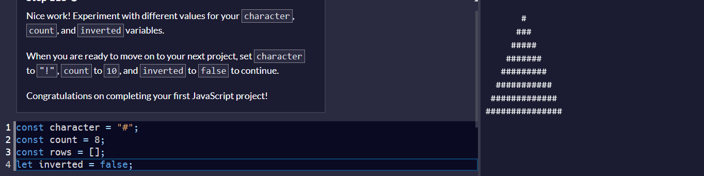
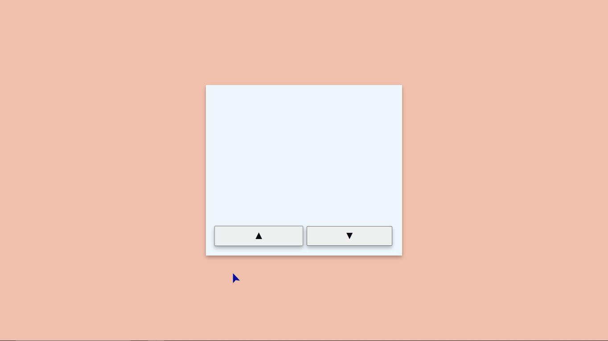

# Pyramid Generator

This is a solution to the [Pyramid Generator - Freecodecamp Javascript Certification](https://www.freecodecamp.org/learn/javascript-algorithms-and-data-structures-v8/). 

## Table of contents

- [Pyramid Generator](#pyramid-generator)
  - [Table of contents](#table-of-contents)
  - [Overview](#overview)
    - [Screenshot](#screenshot)
    - [Links](#links)
  - [My process](#my-process)
    - [Built with](#built-with)
    - [What I learned](#what-i-learned)
    - [Original Code](#original-code)
  - [Improvements](#improvements)
  - [Changes](#changes)
  - [Author](#author)

## Overview

### Screenshot



This screenshot show how the project finished.


### Links

- Solution URL: [Add solution URL here](https://your-solution-url.com)

## My process

### Built with

- Only pure Javascript


### What I learned

In this projejct, I learned few things. One of these was **return value of functions**. In functions, you can return basicly **ANYTHING** that you want. To explain more, soon we will see more about the code.

### Original Code

Here is the original code, made by Freecodecamp:

```javascript
const character = "#";
const count = 8;
const rows = [];
let inverted = true;

function padRow(rowNumber, rowCount) {
  return " ".repeat(rowCount - rowNumber) + character.repeat(2 * rowNumber - 1) + " ".repeat(rowCount - rowNumber);
}

for (let i = 1; i <= count; i++) {
  if (inverted) {
    rows.unshift(padRow(i, count));
  } else {
    rows.push(padRow(i, count));
  }
}

let result = ""

for (const row of rows) {
  result = result + "\n" + row;
}

console.log(result);
```
Explaining the function return we have this:
`return " ".repeat(rowCount - rowNumber) + character.repeat(2 * rowNumber - 1) + " ".repeat(rowCount - rowNumber);`

1. `" ".repeat(rowCount - rowNumber)` - This code repeat an empty string many time as parameters say. It repeats itself twice, once at the beginnig and once at the end. `rowCount` in the loop the first time will be the `count` variable(*8 in this case*) minus `rowNumber` that obey the order of loop. So, in the first lap of loop we have: **rowCount - rowNumber(8 - 1 = 7)**. In the second lap we have: **rowCount - rowNumber(8 - 2 = 6)** and so on.
2. `character.repeat(2 * rowNumber - 1)` - Here we repeat the `character` variable in odd numbers. In the first lap of loop we have: **2 * rowNumber(1) - 1 = 1**. In the second lap we have: **2 * rowNumber(2) - 1 = 3** and so on.


The second part of this code that I will explai is the first loop `for` that makes the pyramid. This is the code: 
```javascript
for (let i = 1; i <= count; i++) {
  if (inverted) {
    rows.unshift(padRow(i, count));
  } else {
    rows.push(padRow(i, count));
  }
}
```
This code basicly check if `inverted` variable checks `true` of `false` to defines the direction of pyramid construction and then call the `padRow()` function with `i` and `count` parameters. If it test `true`, the return of function will be added always in the first index of `rows` array, making thee first result **(remember, repeating 7 times an empty string and 1 time the `character` variable)** with `.unshift()` method. This method always add an element in the begining of an array. Otherwise, if it test `false`, the returning of function will be added always in the last index of `rows` array with `.push()`, making it in the crescent order.

This third part of this code that I will explain is the second loop `for...of`. This loop statement iterates over the values of data structures ***(arrays, objects, Maps, NodeLits and more)***. Here is the code: 

```javascript
let result = ""

for (const row of rows) {
  result = result + "\n" + row;
}

console.log(result)
```
The first step is a variable with `let` called result that is an empty string. It will be used to assign the result of loops in `for...of`. Let take a look what happens within the body of this loop:

  1. `result = result + "\n" + row;`: Here I assign in the `result` variable the elements of `rows` array. `"\n"` is a ***scape character*** used to create a new line. So, in summary, `result` assign and create a new line in each loop and add the corresponding element in `rows` array.


## Improvements

To this project become more dynamic, I made the decision to create more applications.

;

The first thing that I changed was to make the code more modern with ES6. All the function is variable with ***Arrow Functions***. This approach has the same result of creating a function in tradicional way, except to the ***this*** keyword and invoking function. The second change was use more times the ***Ternary Operator***. This operator, as I learned in this certification, is a powerful resource to makes the code cleaner. Now, I will explain the changes that I've made.

## Changes

   1. **Arrow Functions**: All the functions was switched for *Arrow Functions*. 
   2. **HTML Structure**: I've add some elements to user see the logic working. There is two ``<button>`` elements to give the option to choose if ``character`` will be inverted or not.
   3. **Ternary operator**: I decided to use more times the ``Ternary Operator`` instead ``if/else``.


## Author

- Twitter - [@O_DevCarvalho](https://x.com/O_DevCarvalho)
- Github - [Mateus-A-Carvalho](https://github.com/O-DevCarvalho)
- Instagram - [o.mateus.carvalho.dev](https://www.instagram.com/o.mateus.carvalho.dev/)